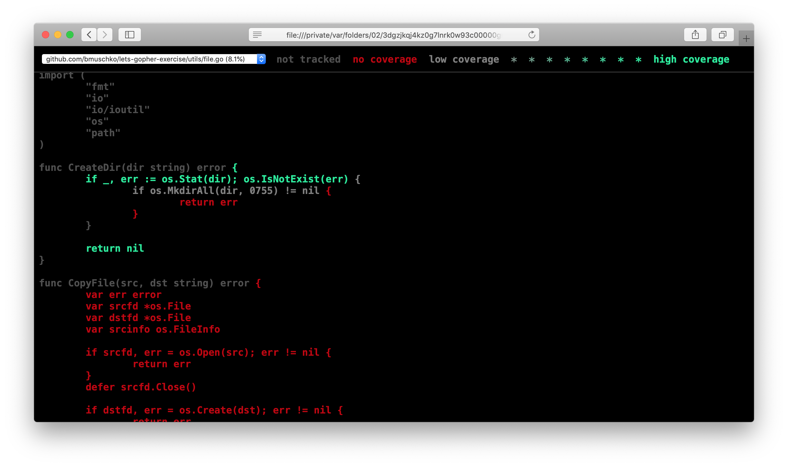

# Solution

## Writing and executing tests

1. Create a new file `file_test.go` in the `utils` package.
2. Copy/paste the code from [file_standard_test.go](./utils/file_standard_test.go) into the file.
3. Run the command `go test ./...`.

```
$ go test ./... -v
=== RUN   TestCreateDirForNonExistentDirectoryWithTestingPackage
--- PASS: TestCreateDirForNonExistentDirectoryWithTestingPackage (0.00s)
=== RUN   TestCreateDirForExistentDirectoryWithTestingPackage
--- PASS: TestCreateDirForExistentDirectoryWithTestingPackage (0.00s)
PASS
ok  	github.com/bmuschko/lets-gopher-exercise/utils	0.007s
```

## Generating code coverage metrics

1. Run the command `go test ./... -coverprofile=coverage.txt -covermode=count`.

```
$ go test ./... -coverprofile=coverage.txt -covermode=count
ok  	github.com/bmuschko/lets-gopher-exercise/utils	0.006s	coverage: 7.3% of statements
```

2. Run the command `go tool cover -html=coverage.txt`. A browser window will open automatically and render the HTML report.

